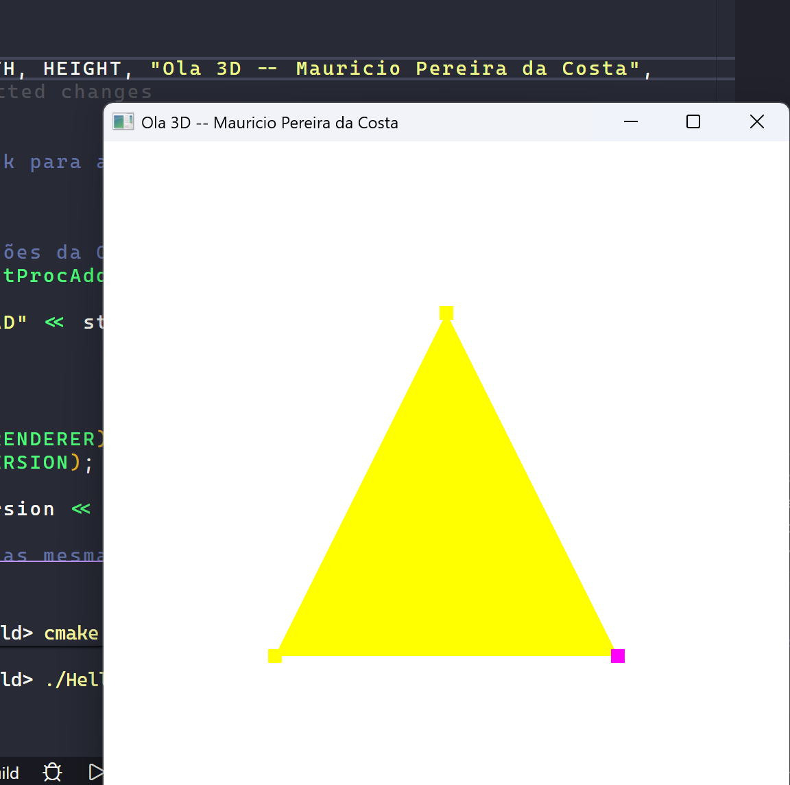

# Desafio M1

Primeira entrega da disciplina. A ideia aqui era basicamente colocar o ambiente de pé: instalar as bibliotecas, configurar o CMake pra puxar GLFW e GLM, baixar a GLAD manualmente e conseguir abrir uma janela renderizando alguma coisa com o pipeline programável do OpenGL.

No fim sai um triângulo amarelo na tela, mas o que importou foi entender o caminho até ele: criar e compilar os shaders (vertex e fragment), montar o VBO com os vértices, configurar o VAO descrevendo o layout dos atributos, e o loop principal com `glClear` / `glDrawArrays` / `glfwSwapBuffers`.

## Sobre o código

O arquivo `Hello3D.cpp` que serviu de base pra esse desafio evoluiu pro Módulo 2 e hoje está em [`src/desafios/M2_CubosInterativos.cpp`](../../src/desafios/M2_CubosInterativos.cpp). A estrutura do pipeline (setup de shader, VAO/VBO, callback de teclado, loop principal) é a mesma — o M2 só trocou o triângulo por um cubo, adicionou matrizes model/view/projection, depth test e múltiplas instâncias.

## Resultado

