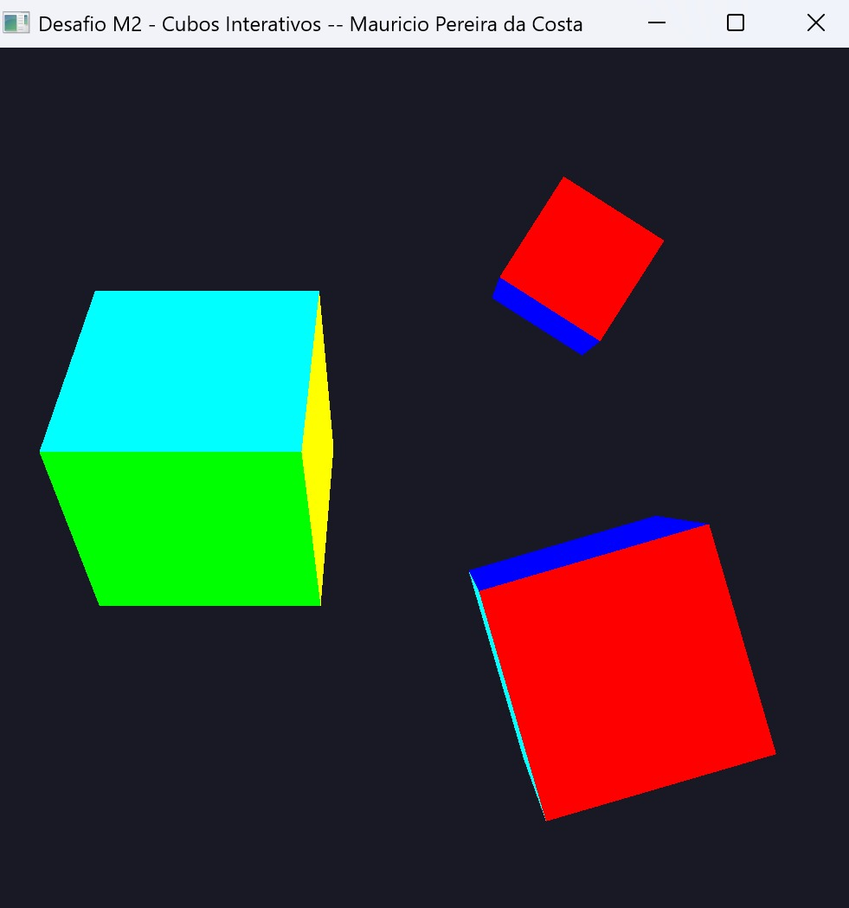

# Desafio M2 — Cubos Interativos

Continuação do que foi feito no M1. A base do `Hello3D.cpp` virou ponto de partida, e aqui o triângulo deu lugar a um cubo 3D com 36 vértices (6 faces, cada uma com cor distinta pra ficar fácil de saber pra onde a peça tá virada). Foi onde entraram as matrizes `model`, `view` e `projection`, o depth test, e a noção de câmera olhando pro objeto a partir de `(0, 0, 3)`.

A parte mais interessante foi sair de "um cubo só" pra ter uma cena com várias instâncias. Criei uma `struct Cube` guardando posição, escala, ângulo acumulado e qual eixo tá girando, e um `vector<Cube>` pra cena toda. Aí o N instancia um cubo novo (deslocado pra não sobrepor) e o TAB alterna qual deles tá recebendo os comandos. As teclas X/Y/Z funcionam como toggle — apertar de novo no mesmo eixo para a rotação naquele eixo, sem zerar o ângulo, então dá pra "congelar" o cubo numa pose.

Detalhe que eu tive que tomar cuidado: movimento e escala precisam ser multiplicados por `dt` (delta time entre frames) pra não ficarem dependentes do FPS. Sem isso, em monitor de 144Hz o cubo voava pela tela e em 60Hz andava devagar.

## Controles

| Tecla       | Ação                                       |
|-------------|--------------------------------------------|
| W / S       | Translação em Z                            |
| A / D       | Translação em X                            |
| I / J       | Translação em Y                            |
| `[` / `]`   | Diminuir / aumentar escala                 |
| X / Y / Z   | Liga/desliga rotação no eixo correspondente|
| N           | Instancia novo cubo                        |
| TAB         | Alterna o cubo selecionado                 |
| ESC         | Sai                                        |

Código-fonte: [`src/desafios/M2_CubosInterativos.cpp`](../../src/desafios/M2_CubosInterativos.cpp)

## Resultado

