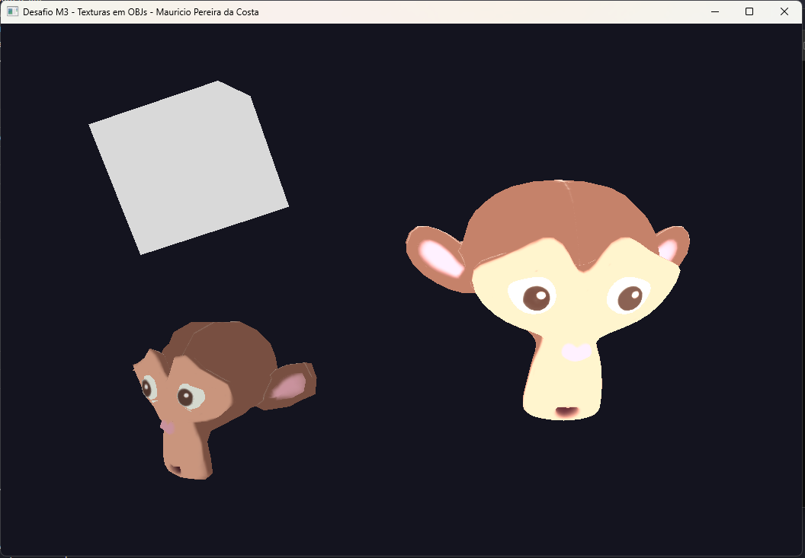

# Desafio M3 — Texturas e Materiais

Continuação direta do M2-vivencial. Ali eu já tinha um visualizador que abria todos os `.obj` de `assets/Modelos3D/` e aplicava transformações por modo (T/R/S). Aqui a parte interessante foi sair de "uma cor por objeto" para realmente **ler as coordenadas de textura do .OBJ**, **interpretar o .MTL** e amostrar uma imagem no fragment shader.

## O que mudou em relação ao M2-vivencial

**1. Leitura do `vt` no .OBJ.** O loader antigo descartava o índice de textura nas faces (`f v/vt/vn` — usava só o `v`). Agora, para cada vértice montado no VBO, eu também pego o `vt` correspondente e empurro o par `(s, t)` no buffer. O layout do vértice passou de 6 floats (xyz + rgb) para **8 floats** (xyz + rgb + st), com `glVertexAttribPointer` em location 2 lendo os dois últimos.

**2. Parser de `.MTL`.** Quando o `.obj` declara `mtllib Suzanne.mtl`, eu guardo esse nome durante a leitura. Depois abro o `.mtl` ao lado do `.obj`, procuro a linha `map_Kd <arquivo>` e resolvo o caminho relativo ao próprio `.mtl`. É um parser bem mínimo de propósito — o enunciado pediu "no momento, apenas o nome da textura a ser carregada".

**3. `loadTexture` adaptada do `TriangleTex.cpp`.** Segui o passo a passo do material de apoio: `glGenTextures`, `glBindTexture`, parâmetros de wrap/filter, `stbi_load`, `glTexImage2D` (com `GL_RGB` ou `GL_RGBA` dependendo de `nrChannels`), `glGenerateMipmap`. Usei `GL_LINEAR_MIPMAP_LINEAR` na minificação porque os modelos ficam visivelmente pequenos na cena (Suzanne com `scale = 0.6`) e o mipmap reduz o "buzz" das texturas.

**4. Flip vertical no `stbi_load`.** Detalhe importante: o Blender exporta `vt` com origem no canto inferior-esquerdo (convenção do OpenGL), mas o `stb_image` lê a imagem com a primeira linha no **topo**. Sem `stbi_set_flip_vertically_on_load(true)` a Suzanne fica com a textura de cabeça pra baixo.

**5. Fallback quando não tem textura.** O `Cube.mtl` que veio do projeto não tem `map_Kd` (só comentários). Em vez de excluir o cubo da cena, eu mantenho ele com a cor de vértice e o fragment shader decide via `uniform int hasTexture`: se a flag é 1, amostra a textura; se é 0, usa `vColor`. Assim o cubo continua aparecendo (branco, neutro) no meio dos dois Suzannes texturizados.

## Shaders

Vertex shader passou a propagar `vTexCoord` (location = 2) para o fragment. O fragment ficou:

```glsl
uniform sampler2D tex_buffer;
uniform int  hasTexture;
uniform int  wireframe;
uniform float tint;

void main() {
    if (wireframe == 1) { color = vec4(1.0); return; }
    vec3 base = (hasTexture == 1) ? texture(tex_buffer, vTexCoord).rgb : vColor;
    color = vec4(clamp(base * tint, 0.0, 1.0), 1.0);
}
```

O `tint` (1.4× pro selecionado, 0.85× pro resto) e o modo wireframe vieram inalterados do M2-vivencial. O `clamp` é só pra não estourar quando o tint multiplica uma cor já clara.

## Estado da cena ao abrir

A pasta hoje tem `Cube.obj`, `Suzanne.obj` e `SuzanneSubdiv1.obj`. Os dois Suzannes apontam pra `Suzanne.png` (color map) — então abrem texturizados. O cubo entra sem textura (branco). A seleção começa no índice 0 (alfabético → Cube).

## Controles

Iguais ao M2-vivencial (a UX não muda):

| Tecla              | O que faz                                    |
|--------------------|----------------------------------------------|
| TAB                | Próximo objeto                               |
| T / R / S          | Modo Translação / Rotação / Escala           |
| L                  | Liga/desliga arestas brancas                 |
| ESC                | Sai                                          |
| **Translação**     | setas (X/Y), PageUp/Down (Z)                 |
| **Rotação**        | X/Y/Z togglam giro                           |
| **Escala**         | X/Y/Z (Shift inverte), `[ ]` ou `- =` uniforme |

## Como rodar

Mesmo caminho relativo do M2-vivencial — o binário precisa ser executado a partir de `build/` pra encontrar `../assets/Modelos3D/`. No Windows com MSYS2:

```powershell
$env:PATH = "C:\msys64\ucrt64\bin;$env:PATH"
cd build
.\M3_TexturasOBJ.exe
```

Código-fonte: [`src/desafios/M3_TexturasOBJ.cpp`](../../src/desafios/M3_TexturasOBJ.cpp)

## Resultado


