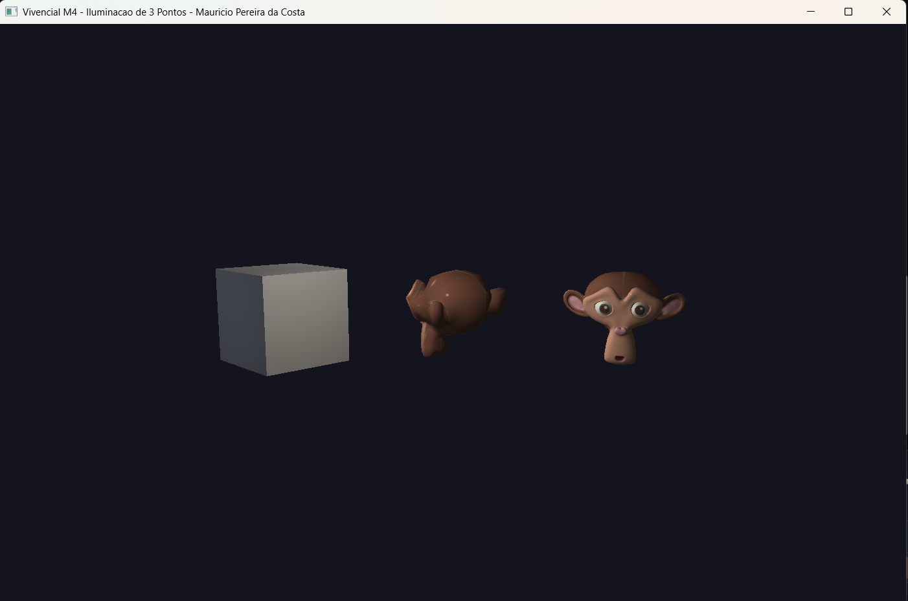

# Atividade Vivencial — Módulo 4

Extensão do desafio M4. Ali eu tinha o modelo de Phong com **uma** luz pontual móvel; aqui a proposta foi montar a **iluminação de três pontos** (key / fill / back) clássica de fotografia e cinema, posicionando as luzes **automaticamente a partir do objeto principal** da cena, e ainda acrescentar um **fator de atenuação** por distância.

## O que mudou em relação ao desafio M4

**1. Três luzes pontuais em vez de uma.** O fragment shader agora recebe arrays de `lightPos`, `lightColor`, `lightIntensity` e `lightOn` (tamanho 3) e faz um loop somando a contribuição de cada luz ligada. A ambiente entra uma vez só; difusa e especular acumulam por luz.

**2. Posicionamento automático pela técnica de 3 pontos.** A cada frame a função `updateLights()` recalcula as posições a partir da **posição e escala do objeto selecionado** (o "objeto principal"). O afastamento das luzes escala com o tamanho do objeto (`dist = 3 * maior_escala`), então quando ele cresce/encolhe ou se move, as luzes acompanham mantendo a proporção:

- **Key (principal)** — a mais intensa (`1.0`), branca levemente quente, à frente/direita/acima. Define o tom da cena.
- **Fill (preenchimento)** — suave (`0.45`), levemente azulada, à frente do lado oposto e mais baixa. Suaviza as sombras que a key cria, sem competir com ela.
- **Back (fundo)** — média (`0.8`), atrás e acima. Faz o contorno do objeto, separando-o do fundo escuro.

**3. Fator de atenuação na difusa (e especular).** Implementei `Fatt = 1 / (Kc + Kl·d + Kq·d²)` exatamente como no material de apoio, com `Kc=1.0, Kl=0.09, Kq=0.032`. Como as três luzes ficam a distâncias diferentes do objeto, a atenuação faz cada uma "pesar" de acordo com o quão perto está — sem ela as três chegariam com a mesma força e o efeito de 3 pontos sumia.

**4. Ligar/desligar cada luz.** As teclas **1**, **2** e **3** togglam respectivamente a key, a fill e a back. Dá pra ver isolada a contribuição de cada uma (ex.: só a back ligada mostra bem o efeito de contorno/separação do fundo).

## Equação implementada

```
I = ambient + Σ  Fatt(d_i) · intensidade_i · [ kd·(N·L_i) + ks·(R_i·V)^q ] · cor_luz_i
        (i = key, fill, back, apenas as ligadas)

result = (ambient + diffuseTotal) · objectColor + specularTotal
```

## Controles

| Tecla              | O que faz                                          |
|--------------------|----------------------------------------------------|
| TAB                | Cicla o **objeto principal** (as luzes seguem ele) |
| T / R / S          | Modo Translação / Rotação / Escala                 |
| **1**              | Liga/desliga a luz **PRINCIPAL** (key)             |
| **2**              | Liga/desliga a luz de **PREENCHIMENTO** (fill)     |
| **3**              | Liga/desliga a luz de **FUNDO** (back)             |
| G                  | Liga/desliga wireframe                             |
| ESC                | Sai                                                |
| **Translação**     | setas (X/Y), PageUp/Down (Z)                       |
| **Rotação**        | X/Y/Z togglam giro                                 |
| **Escala**         | X/Y/Z (Shift inverte), `[ ]` ou `- =` uniforme     |

> Dica: como as luzes são ancoradas no objeto principal, mover/escalar o objeto selecionado (modo T/S) é a forma de reposicionar todo o conjunto de iluminação de uma vez.

## Como rodar

```powershell
$env:PATH = "C:\msys64\ucrt64\bin;$env:PATH"
cd build
.\M4_Vivencial_TresLuzes.exe
```

Código-fonte: [`src/desafios/M4_Vivencial_TresLuzes.cpp`](../../src/desafios/M4_Vivencial_TresLuzes.cpp)

## Resultado


