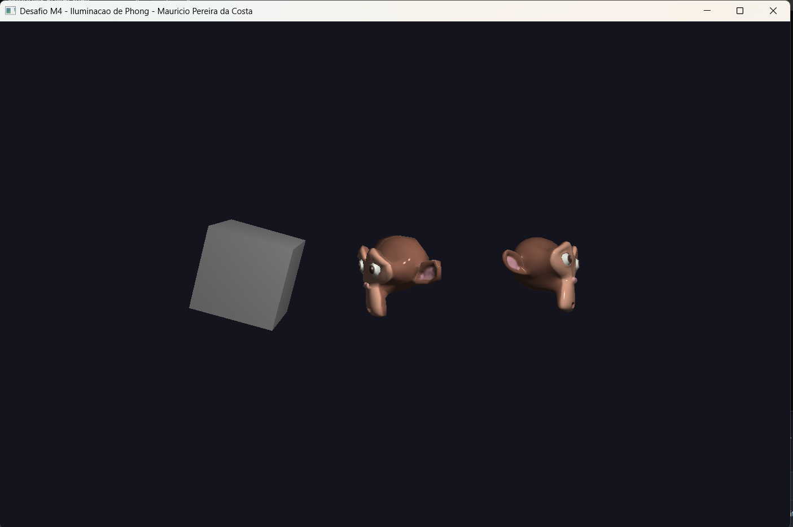

# Desafio M4 — Iluminação (Modelo de Phong)

Continuação direta do M3. No M3 eu já lia textura e material do `.MTL`; aqui o foco foi sair de "cor chapada" para **iluminar a cena de verdade**, implementando o modelo de Phong (ambiente + difusa + especular) com uma fonte de luz pontual.

## O que mudou em relação ao M3

**1. Leitura das normais (`vn`) do `.OBJ`.** O loader do M3 montava o vértice com 8 floats (xyz + rgb + st). Agora cada vértice carrega também a normal, virando **11 floats** (xyz + rgb + st + **nx ny nz**). A face `f v/vt/vn` passou a usar o terceiro índice (`vn`), e o VAO ganhou o atributo de normal em `location = 3`. Como o cubo e as duas Suzannes já vinham com `vn` exportado do Blender, não precisei recalcular nada.

**2. Coeficientes vindos do `.MTL`.** Passei a ler `Ka` (ambiente), `Kd` (difusa), `Ks` (especular) e `Ns` (expoente de brilho `q`). Como `Ka/Kd/Ks` são `vec3` no formato MTL, reduzi cada um a um escalar pela média dos canais — a disciplina trabalha com coeficientes escalares no shader. Detalhe do material que veio do projeto: o `Suzanne.mtl` tem `Ns 233.6`, `Ka 1 1 1` e `Ks 0.5`, mas **não tem linha `Kd`**, então mantenho um `kd` default (0.7). O `Cube.mtl` é vazio, então o cubo usa os defaults inteiros (`ka=0.1, kd=0.7, ks=0.5, q=32`).

**3. Phong no fragment shader.** Segui o passo a passo do material de apoio:

```glsl
vec3 ambient  = ambientStrength * ka * lightColor;

vec3 N = normalize(vNormal);
vec3 L = normalize(lightPos - fragPos);
vec3 diffuse  = kd * max(dot(N, L), 0.0) * lightColor;

vec3 V = normalize(cameraPos - fragPos);
vec3 R = reflect(-L, N);
vec3 specular = ks * pow(max(dot(R, V), 0.0), q) * lightColor;

vec3 result = (ambient + diffuse) * objectColor + specular;
```

A cor base (`objectColor`) continua vindo da textura quando o material tem `map_Kd`, ou da cor de vértice no fallback. A especular **não** recebe a cor do objeto (é o brilho da própria luz), igual ao slide.

## Decisões

- **Matriz normal.** No vertex shader transformo a normal por `mat3(transpose(inverse(model)))` em vez de só `model`. Isso evita que a iluminação "quebre" quando o objeto recebe escala não-uniforme (o que é possível no modo de escala por eixo herdado do M2/M3).
- **`ambientStrength`.** O `Ka` do Blender vem `1 1 1`, o que deixaria o ambiente saturado e mataria o efeito 3D do Phong. Adicionei um `ambientStrength` (0.2) multiplicando a parcela ambiente — assim respeito o `Ka` do material mas mantenho o sombreado visível.
- **Luz móvel.** Para conseguir avaliar a especular/difusa de vários ângulos sem precisar girar o objeto, a fonte de luz pode ser movida pelo teclado (I/J/K/L em X/Y, U/O em Z).

## Controles

| Tecla              | O que faz                                    |
|--------------------|----------------------------------------------|
| TAB                | Próximo objeto                               |
| T / R / S          | Modo Translação / Rotação / Escala           |
| I / K              | Move a luz em Y (cima / baixo)               |
| J / L              | Move a luz em X (esquerda / direita)         |
| U / O              | Move a luz em Z (frente / trás)              |
| G                  | Liga/desliga wireframe                       |
| ESC                | Sai                                          |
| **Rotação**        | X/Y/Z togglam giro                           |
| **Escala**         | X/Y/Z (Shift inverte), `[ ]` ou `- =` uniforme |

## Como rodar

Mesmo caminho relativo dos desafios anteriores — o binário precisa rodar a partir de `build/` para achar `../assets/Modelos3D/`. No Windows com MSYS2:

```powershell
$env:PATH = "C:\msys64\ucrt64\bin;$env:PATH"
cd build
.\M4_Phong.exe
```

Código-fonte: [`src/desafios/M4_Phong.cpp`](../../src/desafios/M4_Phong.cpp)

## Resultado


