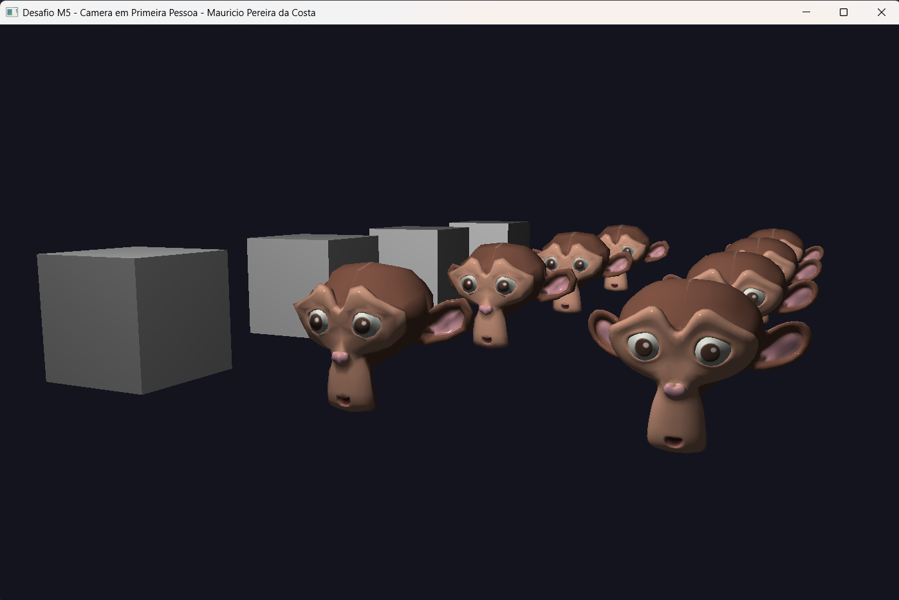

# Desafio M5 — Câmera Sintética (navegação em 1ª pessoa)

Até o M4 o observador era fixo: a matriz de `view` era montada uma única vez com `glm::lookAt` e a gente só mexia nos objetos. Aqui o foco foi sair desse observador parado e simular uma **câmera sintética** de verdade — com projeção perspectiva e dando para **andar pela cena em primeira pessoa**, igual aos visualizadores 3D do material de apoio.

## O que mudou em relação ao M4

**1. A câmera virou uma classe.** Como o material sugeria, encapsulei tudo numa classe `Camera` que guarda a posição e a orientação do observador (`yaw`/`pitch` e os vetores `front`/`right`/`up`) e expõe as ações de **Mover** e **Rotacionar**:

- `move(Direction, dt)` — desloca a posição ao longo de `front`/`right`/`worldUp`, sempre multiplicando pelo `deltaTime` para o movimento ficar independente do framerate.
- `rotate(xoffset, yoffset)` — soma o deslocamento do mouse no `yaw`/`pitch`, trava o `pitch` em ±89° (senão a câmera "vira de cabeça pra baixo") e recalcula a base de vetores.
- `zoom(yoffset)` — o scroll altera o FOV.

A `view` deixou de ser fixa: a cada frame eu chamo `lookAt(position, position + front, up)`.

**2. Projeção perspectiva no lugar da ortográfica.** A `projection` agora é `glm::perspective(fov, aspect, 0.1, 100.0)`, recalculada por frame junto com o FOV do zoom. É isso que dá a ilusão de profundidade — objetos mais longe parecem menores.

**3. A cena ficou navegável.** Em vez de uma fileira só, distribuí várias instâncias dos modelos numa grade indo em profundidade (`-Z`). Andar para frente/trás deixa o efeito da perspectiva bem visível.

**4. Mouse capturado.** Uso `GLFW_CURSOR_DISABLED` para esconder e prender o cursor, e a `mouse_callback` calcula o deslocamento entre frames (com o `firstMouse` para não dar um "pulo" no primeiro movimento). O `yoffset` é invertido porque em tela o Y cresce para baixo.

## Detalhes

- **`front` a partir dos ângulos de Euler** — `front.x = cos(yaw)·cos(pitch)`, `front.y = sin(pitch)`, `front.z = sin(yaw)·cos(pitch)`. O `yaw` inicial é `-90°` para a câmera já começar olhando para `-Z`.
- **`right` e `up` recalculados** — depois de atualizar o `front`, refaço `right = cross(front, worldUp)` e `up = cross(right, front)`, mantendo a base ortonormal.
- **Iluminação do M4 mantida** — o shader Phong é o mesmo; só que agora o `cameraPos` enviado para o specular é a posição real da câmera, então o brilho acompanha o observador enquanto ele anda.

## Controles

| Tecla / Input      | O que faz                                |
|--------------------|------------------------------------------|
| W / A / S / D      | Anda para frente / esquerda / trás / direita |
| Space / Ctrl       | Sobe / desce (no eixo do mundo)          |
| Shift (segurar)    | Anda mais rápido                         |
| Mouse              | Olha ao redor (yaw / pitch)              |
| Scroll             | Zoom (altera o FOV)                      |
| G                  | Liga/desliga wireframe                   |
| ESC                | Sai                                      |

## Como rodar

Mesmo caminho relativo dos desafios anteriores — o binário precisa rodar a partir de `build/` para achar `../assets/Modelos3D/`. No Windows com MSYS2:

```powershell
$env:PATH = "C:\msys64\ucrt64\bin;$env:PATH"
cd build
.\M5_CameraPrimeiraPessoa.exe
```

Código-fonte: [`src/desafios/M5_CameraPrimeiraPessoa.cpp`](../../src/desafios/M5_CameraPrimeiraPessoa.cpp)

## Resultado


