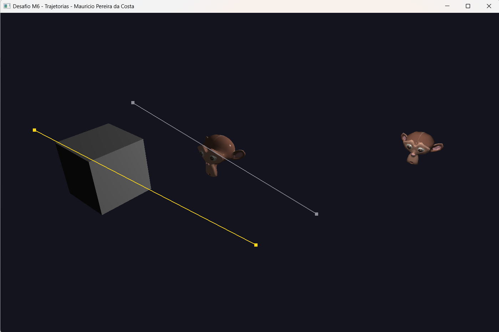

# Desafio M6 — Trajetórias

Continuação direta do M5. Lá eu já tinha uma câmera sintética navegável sobre a cena Phong; aqui o foco foi dar **movimento próprio aos objetos**: cada objeto pode ter uma **trajetória** (uma lista de pontos de controle) que ele percorre **repetidamente** e de forma **cíclica**.

Como o enunciado pediu, este desafio ainda **não** usa interpolação por curva cúbica — a translação entre os pontos de controle é **linear**. A curva (Bézier/Catmull-Rom) entra na Atividade Vivencial.

## O que mudou em relação ao M5

**1. Voltou a seleção de objeto.** O M5 tinha uma grade de instâncias sem seleção. Aqui montei uma cena mais limpa (uma instância por modelo, em fila) e trouxe de volta o **TAB** para escolher qual objeto recebe os pontos. O selecionado fica realçado por um `tint` no shader.

**2. Cada objeto guarda sua própria trajetória.** Estendi a `struct Instance` com:

```cpp
vector<glm::vec3> traj;   // pontos de controle (em coordenadas de mundo)
int   trajSeg  = 0;       // segmento atual (entre traj[seg] e traj[seg+1])
float trajDist = 0.0f;    // distância já percorrida nesse segmento
```

**3. Mecanismo de adicionar pontos no espaço.** Optei pelo controle via **teclado + câmera**: você voa com a câmera (WASD + mouse) até o ponto desejado e pressiona **P** para "soltar" um waypoint na **posição atual da câmera**, que é empurrado na lista `traj` do objeto selecionado. Dá para remover o último (**Backspace**) ou limpar tudo (**C**).

**4. Salvar e carregar.** **F2** grava todas as trajetorias em `../assets/trajetorias.cfg` (um formato texto bem simples: `OBJECT <nome> <n>` seguido de uma linha `x y z` por ponto). Esse arquivo é **lido automaticamente na inicialização**, então as trajetórias persistem entre execuções.

**5. Translação cíclica.** Com **Enter** eu ligo/desligo a animação. Quando ligada, cada objeto com pelo menos 2 pontos avança ao longo dos segmentos por translação linear; ao chegar no último ponto, ele volta para o primeiro — o ciclo é fechado usando `(seg + 1) % n`.

## Como o movimento é calculado

Para o movimento ficar com velocidade aproximadamente constante (e não acelerar nos segmentos longos), eu avanço uma **distância** `trajSpeed * dt` por frame e a distribuo pelos segmentos, consumindo o que sobra ao cruzar um waypoint:

```cpp
float left = segLen - inst.trajDist;
if (remaining < left) { inst.trajDist += remaining; remaining = 0; }
else { remaining -= left; inst.trajSeg = (inst.trajSeg + 1) % n; inst.trajDist = 0; }
// posição final = lerp(traj[seg], traj[(seg+1)%n], trajDist / segLen)
```

Segmentos degenerados (dois waypoints no mesmo lugar) são pulados para não dividir por zero.

## Visualização da trajetória

Desenho os pontos de controle e o caminho usando o **mesmo programa de shader**, com dois uniforms novos (`useFlat` / `flatColor`) que ignoram a iluminação e pintam com cor chapada. Uso `GL_LINE_LOOP` (em vez de `GL_LINE_STRIP`) justamente para mostrar o trecho que **fecha o ciclo** do último ponto de volta ao primeiro, e `GL_POINTS` para marcar os waypoints. O desenho é feito com o *depth test* desligado para os marcadores ficarem sempre visíveis. A trajetória do objeto selecionado aparece em **amarelo**; as demais, em cinza.

## Controles

| Tecla / Input      | O que faz                                       |
|--------------------|-------------------------------------------------|
| W / A / S / D      | Anda com a câmera                               |
| Space / Ctrl       | Sobe / desce a câmera                           |
| Shift (segurar)    | Anda mais rápido                                |
| Mouse / Scroll     | Olha ao redor / zoom                            |
| **TAB**            | Seleciona o próximo objeto                      |
| **P**              | Adiciona um waypoint na posição atual da câmera |
| **Backspace**      | Remove o último waypoint do objeto selecionado  |
| **C**              | Limpa a trajetória do objeto selecionado        |
| **Enter**          | Liga/desliga a animação (play/pause)            |
| **[ / ]**          | Diminui / aumenta a velocidade                  |
| **F2**             | Salva as trajetórias em arquivo                 |
| G                  | Liga/desliga wireframe                          |
| ESC                | Sai                                             |

## Fluxo de uso

1. **TAB** até selecionar o objeto desejado (realçado).
2. Voe com a câmera e pressione **P** em alguns lugares para criar os waypoints (mínimo 2).
3. Pressione **Enter** para ver o objeto percorrer o caminho ciclicamente; ajuste a velocidade com **[** / **]**.
4. **F2** para salvar — na próxima execução o caminho já vem carregado.

## Como rodar

Mesmo caminho relativo dos desafios anteriores — o binário precisa rodar a partir de `build/` para achar `../assets/`. No Windows com MSYS2:

```powershell
$env:PATH = "C:\msys64\ucrt64\bin;$env:PATH"
cd build
.\M6_Trajetorias.exe
```

Código-fonte: [`src/desafios/M6_Trajetorias.cpp`](../../src/desafios/M6_Trajetorias.cpp)

## Resultado


